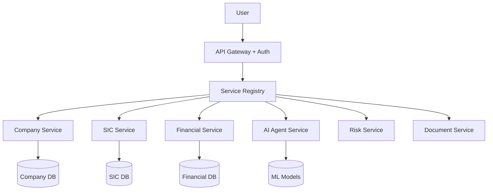

# 🏛️ Platform Architecture Strategy: User-Controlled Service Access

## 🎯 Executive Summary

For a **scalable platform with user-specific service access**, I recommend a **hybrid approach** combining:
1. **Domain-Based Services** (functionality)
2. **API Gateway Pattern** (interface control)  
3. **User Access Management** (permission-based access)

This gives you **maximum flexibility** for:
- ✅ **Per-user service access control**
- ✅ **Independent service scaling** 
- ✅ **Flexible pricing models**
- ✅ **Easy service addition/removal**

---

## 🔍 Architectural Approach Analysis

### 1️⃣ **Functionality-Based (Domain Services)** ⭐ RECOMMENDED
```
Credit Risk Platform
├── 🏢 Company Intelligence Service
├── 📊 SIC Classification Service  
├── 💰 Financial Analysis Service
├── 🤖 AI Agent Orchestration Service
├── 📈 Risk Assessment Service
├── 🔍 Document Analysis Service
└── 📋 Workflow Management Service
```

**✅ Pros:**
- **Business-aligned** - services match user needs
- **Independent scaling** - scale popular services more
- **Easy billing** - charge per service usage
- **Clear boundaries** - each service has specific purpose
- **User-friendly** - users understand what they're buying

**❌ Cons:**
- **Cross-service dependencies** need careful management
- **Data consistency** across services requires coordination

### 2️⃣ **API-Based (Interface-Driven)**
```
Platform APIs
├── REST APIs (/api/v1/companies, /api/v1/sic, etc.)
├── GraphQL APIs (flexible queries)
├── Webhook APIs (event-driven)
└── Streaming APIs (real-time data)
```

**✅ Pros:**
- **Technology agnostic** - services can use different tech
- **Easy integration** - standard interfaces
- **Version management** - API versioning

**❌ Cons:**
- **Technical focus** - not business-aligned
- **Complex access control** - need API-level permissions
- **User confusion** - technical concepts vs business needs

### 3️⃣ **Technical Components (Layer-Based)**
```
Technical Layers
├── Data Layer (repositories, databases)
├── Business Layer (services, rules) 
├── API Layer (controllers, routes)
└── UI Layer (interfaces, dashboards)
```

**✅ Pros:**
- **Clean separation** - technical concerns isolated
- **Easy testing** - layer-by-layer testing
- **Developer-friendly** - matches coding patterns

**❌ Cons:**
- **Not user-focused** - technical concepts
- **Monolithic tendencies** - layers can become large
- **Poor business alignment** - doesn't match user needs

---

## 🏆 **RECOMMENDED: Hybrid Service-Oriented Platform**

### 🎯 Core Philosophy
**"Users subscribe to business services, not technical APIs"**



### 🔑 Key Components

#### **1. Service Registry & Discovery**
```python
class ServiceRegistry:
    def __init__(self):
        self.services = {
            'company-intelligence': {
                'name': 'Company Intelligence',
                'description': 'Company data and insights',
                'version': '1.0',
                'endpoints': ['/api/v1/companies', '/api/v1/company-search'],
                'permissions': ['read_companies', 'search_companies'],
                'pricing_tier': 'standard'
            },
            'sic-classification': {
                'name': 'SIC Classification',
                'description': 'AI-powered SIC code prediction',
                'version': '2.0',
                'endpoints': ['/api/v1/sic/predict', '/api/v1/sic/update'],
                'permissions': ['predict_sic', 'update_sic'],
                'pricing_tier': 'premium'
            },
            # ... more services
        }
    
    def get_user_services(self, user_id: str) -> List[str]:
        """Get services user has access to"""
        user_permissions = self.get_user_permissions(user_id)
        return [svc for svc, config in self.services.items() 
                if any(perm in user_permissions for perm in config['permissions'])]
```

#### **2. User Access Control Matrix**
```python
class UserAccessControl:
    def __init__(self):
        self.access_matrix = {
            'user_123': {
                'subscription': 'enterprise',
                'services': ['company-intelligence', 'sic-classification', 'ai-agents'],
                'permissions': ['read_companies', 'predict_sic', 'run_ai_workflows'],
                'rate_limits': {'requests_per_minute': 1000},
                'features': ['advanced_analytics', 'bulk_processing']
            },
            'user_456': {
                'subscription': 'standard', 
                'services': ['company-intelligence'],
                'permissions': ['read_companies'],
                'rate_limits': {'requests_per_minute': 100},
                'features': ['basic_search']
            }
        }
    
    def can_access_service(self, user_id: str, service_name: str) -> bool:
        """Check if user can access specific service"""
        user_data = self.access_matrix.get(user_id, {})
        return service_name in user_data.get('services', [])
```

#### **3. API Gateway with Service Routing**
```python
class ServiceGateway:
    def __init__(self, registry: ServiceRegistry, access_control: UserAccessControl):
        self.registry = registry
        self.access_control = access_control
    
    def route_request(self, user_id: str, service_name: str, endpoint: str):
        """Route request to appropriate service with access control"""
        
        # 1. Check user access
        if not self.access_control.can_access_service(user_id, service_name):
            raise PermissionDeniedError(f"User {user_id} cannot access {service_name}")
        
        # 2. Get service configuration
        service_config = self.registry.get_service(service_name)
        
        # 3. Route to service
        service_instance = self.get_service_instance(service_name)
        return service_instance.handle_request(endpoint, user_context={'user_id': user_id})
```

---

## 🏗️ **Platform Services Architecture**

### 🎯 **Business-Aligned Services**

#### **1. Company Intelligence Service**
```python
class CompanyIntelligenceService:
    """
    Handles all company-related functionality
    - Company search and discovery
    - Company profile management
    - Company relationships
    - Market intelligence
    """
    
    endpoints = [
        'GET /api/v1/companies/{id}',
        'POST /api/v1/companies/search', 
        'GET /api/v1/companies/{id}/relationships',
        'GET /api/v1/companies/{id}/market-position'
    ]
    
    permissions_required = ['read_companies', 'search_companies']
    pricing_model = 'per_company_lookup'
```

#### **2. SIC Classification Service** 
```python
class SICClassificationService:
    """
    AI-powered SIC code prediction and management
    - Fuzzy matching with 751+ SIC codes
    - Machine learning predictions
    - User feedback integration
    - Accuracy tracking
    """
    
    endpoints = [
        'POST /api/v1/sic/predict',
        'POST /api/v1/sic/update',
        'GET /api/v1/sic/accuracy-stats',
        'POST /api/v1/sic/batch-predict'
    ]
    
    permissions_required = ['predict_sic', 'update_sic']
    pricing_model = 'per_prediction'
```

#### **3. Financial Analysis Service**
```python
class FinancialAnalysisService:
    """
    Financial data processing and analysis
    - Revenue analysis and predictions
    - Financial health scoring
    - Turnover estimation
    - Risk indicators
    """
    
    endpoints = [
        'POST /api/v1/financial/analyze',
        'GET /api/v1/financial/health-score/{company_id}',
        'POST /api/v1/financial/predict-turnover',
        'GET /api/v1/financial/risk-indicators/{company_id}'
    ]
    
    permissions_required = ['analyze_financials', 'predict_revenue']
    pricing_model = 'per_analysis'
```

#### **4. AI Agent Orchestration Service**
```python
class AIAgentService:
    """
    Multi-agent AI workflows and orchestration
    - Custom workflow creation
    - Agent coordination
    - Real-time processing
    - Workflow monitoring
    """
    
    endpoints = [
        'POST /api/v1/ai/workflows/execute',
        'GET /api/v1/ai/workflows/{id}/status', 
        'POST /api/v1/ai/agents/orchestrate',
        'GET /api/v1/ai/agents/capabilities'
    ]
    
    permissions_required = ['execute_ai_workflows', 'orchestrate_agents']
    pricing_model = 'per_execution' # Higher cost
```

### 🛡️ **Access Control Implementation**

#### **Service-Level Permissions**
```python
SERVICE_PERMISSIONS = {
    'company-intelligence': {
        'basic': ['read_companies'],
        'standard': ['read_companies', 'search_companies'],
        'premium': ['read_companies', 'search_companies', 'bulk_export'],
        'enterprise': ['*']  # All permissions
    },
    'sic-classification': {
        'basic': [],  # Not available in basic
        'standard': ['predict_sic'],
        'premium': ['predict_sic', 'update_sic', 'batch_predict'],
        'enterprise': ['predict_sic', 'update_sic', 'batch_predict', 'advanced_analytics']
    },
    'ai-agents': {
        'basic': [],  # Not available
        'standard': [],  # Not available  
        'premium': ['execute_simple_workflows'],
        'enterprise': ['execute_ai_workflows', 'orchestrate_agents', 'custom_agents']
    }
}
```

#### **Dynamic Service Discovery**
```python
@app.route('/api/v1/user/services')
@require_auth
def get_user_services():
    """Get services available to current user"""
    user_id = get_current_user_id()
    user_subscription = get_user_subscription(user_id)
    
    available_services = []
    for service_name, service_config in SERVICE_REGISTRY.items():
        user_permissions = SERVICE_PERMISSIONS[service_name].get(user_subscription, [])
        
        if user_permissions:  # User has at least some permissions
            available_services.append({
                'name': service_name,
                'display_name': service_config['display_name'],
                'description': service_config['description'],
                'available_endpoints': get_accessible_endpoints(service_name, user_permissions),
                'usage_limits': get_user_limits(user_id, service_name),
                'pricing': service_config['pricing_model']
            })
    
    return jsonify({'services': available_services})
```

---

## 🎮 **User Experience Design**

### 🖥️ **Service Selection Dashboard**
```javascript
// Frontend: Service selection interface
const ServiceDashboard = () => {
    const [userServices, setUserServices] = useState([]);
    
    useEffect(() => {
        fetch('/api/v1/user/services')
            .then(r => r.json())
            .then(data => setUserServices(data.services));
    }, []);
    
    return (
        <div className="service-dashboard">
            <h2>Your Available Services</h2>
            {userServices.map(service => (
                <ServiceCard 
                    key={service.name}
                    name={service.display_name}
                    description={service.description}
                    endpoints={service.available_endpoints}
                    onActivate={() => activateService(service.name)}
                />
            ))}
        </div>
    );
};
```

### 🔐 **Service Activation Flow**
```python
@app.route('/api/v1/services/<service_name>/activate', methods=['POST'])
@require_auth
def activate_service(service_name: str):
    """Activate a service for the user"""
    user_id = get_current_user_id()
    
    # Check if user can access this service
    if not can_access_service(user_id, service_name):
        return jsonify({'error': 'Service not available for your subscription'}), 403
    
    # Initialize service for user
    service_instance = get_service_instance(service_name)
    service_instance.initialize_for_user(user_id)
    
    # Track activation
    track_service_activation(user_id, service_name)
    
    return jsonify({
        'status': 'activated',
        'service': service_name,
        'endpoints': get_service_endpoints(service_name, user_id),
        'documentation_url': f'/docs/services/{service_name}'
    })
```

---

## 🚀 **Migration Strategy**

### 📅 **Phase 1: Service Extraction (Current → Services)**
```
Current flask_main.py (1,699 lines)
↓
Extract to Services:
├── CompanyService (300 lines) - Company data management
├── SICService (400 lines) - SIC classification 
├── FinancialService (200 lines) - Revenue/financial analysis
├── WorkflowService (300 lines) - Workflow management
├── DataService (200 lines) - Data loading/management
└── UtilityService (100 lines) - Helper functions
```

### 📅 **Phase 2: Service Registry Implementation**
```python
# Step 1: Create service registry
class PlatformServiceRegistry:
    def __init__(self):
        self.services = {}
        self.user_access = UserAccessControl()
    
    def register_service(self, service_class):
        """Register a service with the platform"""
        service_instance = service_class()
        self.services[service_instance.name] = service_instance
        
    def get_user_accessible_services(self, user_id: str):
        """Get services user can access"""
        return [svc for svc in self.services.values() 
                if self.user_access.can_access_service(user_id, svc.name)]
```

### 📅 **Phase 3: API Gateway Implementation**
```python
# API Gateway that routes to services based on user permissions
class ServiceAPIGateway:
    def __init__(self, service_registry):
        self.registry = service_registry
        
    @app.route('/api/v1/<service_name>/<path:endpoint>')
    def route_to_service(service_name, endpoint):
        user_id = get_current_user_id()
        
        # Check access
        if not self.registry.can_access_service(user_id, service_name):
            return jsonify({'error': 'Access denied'}), 403
            
        # Route to service
        service = self.registry.get_service(service_name)
        return service.handle_request(endpoint, request)
```

---

## 🎯 **Implementation Example**

### 🏢 **Service Base Class**
```python
from abc import ABC, abstractmethod
from typing import List, Dict, Any

class BaseService(ABC):
    """Base class for all platform services"""
    
    @property
    @abstractmethod
    def name(self) -> str:
        """Service unique identifier"""
        pass
    
    @property  
    @abstractmethod
    def display_name(self) -> str:
        """User-friendly service name"""
        pass
        
    @property
    @abstractmethod
    def endpoints(self) -> List[str]:
        """Available API endpoints"""
        pass
        
    @property
    @abstractmethod
    def required_permissions(self) -> List[str]:
        """Permissions needed to access service"""
        pass
        
    @abstractmethod
    def initialize_for_user(self, user_id: str) -> bool:
        """Initialize service for specific user"""
        pass
        
    @abstractmethod
    def handle_request(self, endpoint: str, request_data: Dict[str, Any]) -> Dict[str, Any]:
        """Handle incoming API request"""
        pass
```

### 🔧 **Concrete Service Implementation**
```python
class SICClassificationService(BaseService):
    name = 'sic-classification'
    display_name = 'SIC Classification Service'
    endpoints = ['/predict', '/update', '/batch-predict', '/accuracy-stats']
    required_permissions = ['predict_sic']
    
    def __init__(self):
        self.sic_matcher = None  # Lazy load
        
    def initialize_for_user(self, user_id: str) -> bool:
        """Initialize SIC matcher for user"""
        if not self.sic_matcher:
            from app.utils.enhanced_sic_matcher import get_enhanced_sic_matcher
            self.sic_matcher = get_enhanced_sic_matcher()
        return True
        
    def handle_request(self, endpoint: str, request_data: Dict[str, Any]) -> Dict[str, Any]:
        """Handle SIC service requests"""
        if endpoint == '/predict':
            return self._predict_sic(request_data)
        elif endpoint == '/update':
            return self._update_sic(request_data)
        elif endpoint == '/batch-predict':
            return self._batch_predict(request_data)
        else:
            return {'error': 'Endpoint not found'}
            
    def _predict_sic(self, data: Dict[str, Any]) -> Dict[str, Any]:
        """SIC prediction logic"""
        business_description = data.get('business_description', '')
        prediction = self.sic_matcher.predict_sic_code(business_description)
        return {
            'sic_code': prediction['sic_code'],
            'confidence': prediction['confidence'],
            'description': prediction['description']
        }
```

---

## 🏁 **Next Steps & Recommendations**

### 🎯 **Immediate Actions**
1. **Start with Service Extraction** - Move SIC classification out of flask_main.py
2. **Implement Service Registry** - Basic version with user permissions
3. **Create API Gateway** - Route requests based on user access
4. **Add User Dashboard** - Let users see their available services

### 🚀 **Long-term Vision**
- **Microservices Ready** - Each service can become independent microservice
- **Multi-tenant SaaS** - Different user tiers with different service access  
- **Marketplace Model** - Users can subscribe to individual services
- **Third-party Services** - Allow external services to register with platform

### 💡 **Key Benefits**
- ✅ **Granular Access Control** - Users get exactly what they pay for
- ✅ **Scalable Business Model** - Price per service, not per user
- ✅ **Independent Development** - Teams can work on different services
- ✅ **Easy Service Addition** - New services plug into existing platform
- ✅ **User-Centric Design** - Users understand what they're getting

---

**Ready to build the future of your platform? Let's start with Phase 1 - Service Extraction! 🚀**